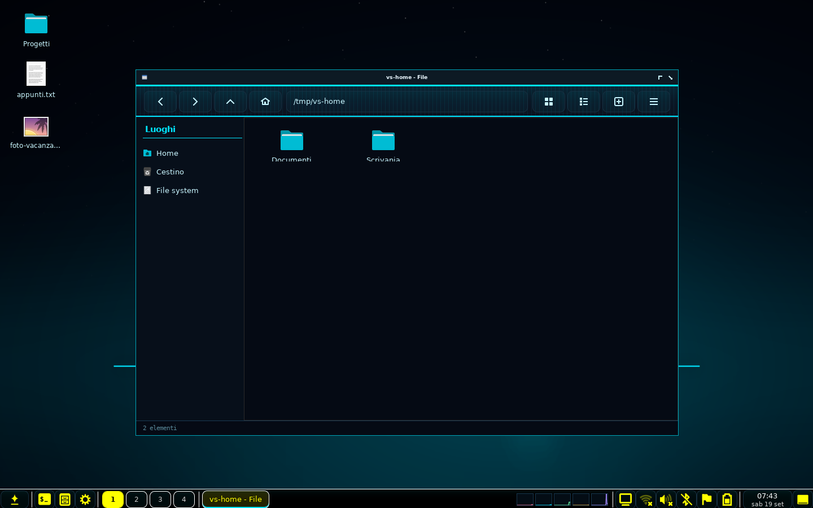
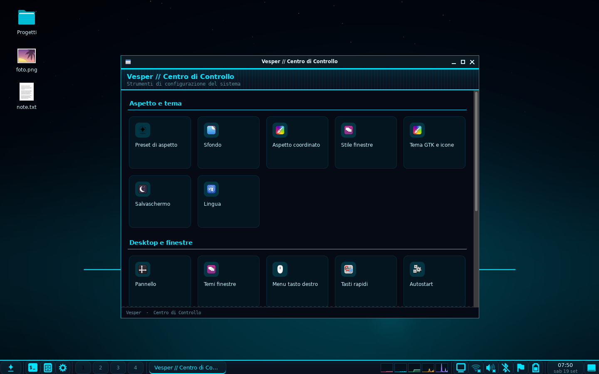
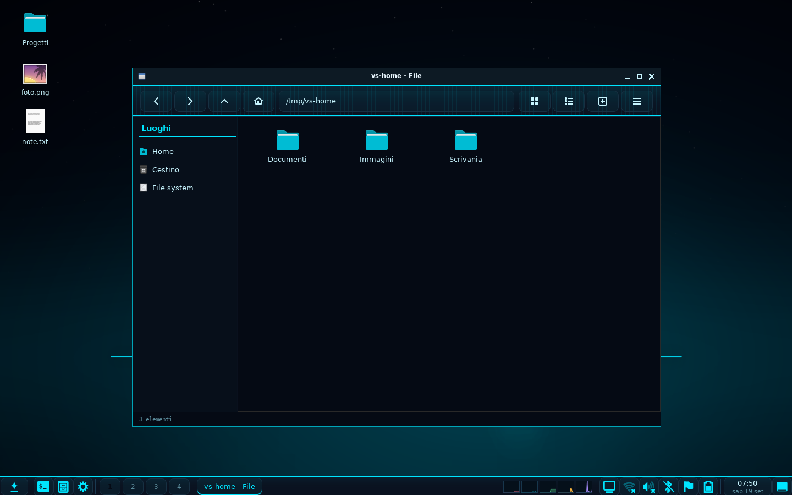
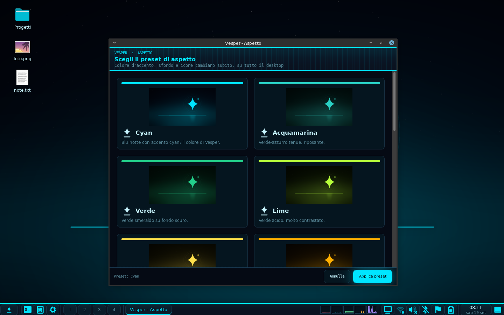
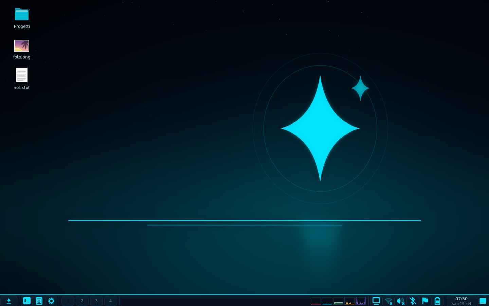

<p align="center">
  <picture>
    <source media="(prefers-color-scheme: dark)" srcset="docs/img/banner-chiaro.png">
    <source media="(prefers-color-scheme: light)" srcset="docs/img/banner.png">
    
  </picture>
</p>

# Vesper

**Vesper** è un ambiente desktop (Desktop Environment) leggero scritto in
**Python + GTK3**, e si installa come un qualsiasi altro DE: dopo
l'installazione compare fra le sessioni del gestore di accesso e si sceglie al
login.

> "Vesper" = la stella della sera: interfaccia **flat**, con accento luminoso
> (cyan di serie) e un colore che cambia insieme sfondo, icone e finestre.



## Installazione

**Debian, Ubuntu, Linux Mint** — pacchetto `.deb`:

```sh
sudo apt install ./vesper_0.5.0_all.deb     # scarica il .deb dalle release
```

**Da sorgenti, su qualsiasi distribuzione:**

```sh
tar xzf vesper-0.5.0.tar.gz && cd vesper-0.5.0
sudo ./install.sh                 # in /usr/local
sudo ./install.sh --prefix=/usr   # in /usr (come i pacchetti della distro)
./install.sh --user               # in ~/.local, senza root
sudo ./install.sh --uninstall     # rimuove (la configurazione utente resta)
```

Poi si esce dalla sessione e al login si sceglie **Vesper** nell'elenco delle
sessioni.

### Pacchetti

Tutte le ricette partono dallo **stesso `install.sh`** con `DESTDIR`, quindi
l'albero dei file è identico ovunque; cambiano solo i nomi delle dipendenze.

| Formato | Ricetta | Come si costruisce |
|---|---|---|
| `.deb` (Debian/Ubuntu/Mint) | `tools/make-deb.sh` | `./tools/make-deb.sh` |
| sorgenti `.tar.gz` | `tools/make-tarball.sh` | `./tools/make-tarball.sh` |
| Arch/Manjaro | `packaging/arch/PKGBUILD` | `makepkg -si` |
| Fedora/openSUSE | `packaging/rpm/vesper.spec` | `rpmbuild -ba` |
| Alpine | `packaging/alpine/APKBUILD` | `abuild -r` |

### Cosa serve

| Componente | Perché | Debian/Ubuntu |
|---|---|---|
| openbox | window manager | `openbox` |
| python3 + PyGObject + Cairo | tutto il desktop | `python3-gi python3-gi-cairo gir1.2-gtk-3.0` |
| wmctrl | lista finestre e desktop virtuali del pannello | `wmctrl` |
| xrandr | gestione schermi | `x11-xserver-utils` |

Opzionali: `dunst` (notifiche), un agente PolicyKit, `xautolock` (salvaschermo
automatico), `picom` (vetro reale/angoli arrotondati), `brightnessctl`,
`bluez` + `bluez-tools`, `xwallpaper`/`feh` (solo se si usa il pannello di
Vesper sotto un altro desktop). L'installatore segnala cosa manca, con il
comando giusto per Debian/Ubuntu, Fedora, Arch e Alpine.

### Quanta memoria occupa

Misurata in **PSS** (la quota di memoria che tocca davvero a ogni processo:
sommare gli RSS conta GTK una volta per processo e gonfia il totale).

| Sessione | Memoria |
|---|---|
| pannello + icone del desktop + avvio caldo + Openbox | **~120 MiB** |
| senza l'avvio caldo (`vesper-launcherd --off`) | **~87 MiB** |
| solo pannello e window manager | **~47 MiB** |

Di questi, circa **30 MiB per processo sono GTK3 stessa**: il codice di Vesper
ne aggiunge 2-5. Un desktop scritto in C con la stessa libreria parte dalla
stessa base. Il disco occupato dall'installazione è ~6 MiB.

Serve almeno **512 MiB di RAM** perché ci stiano anche il sistema e un
browser; Vesper da solo gira in 256 MiB.

**`vesper-ram`** dice dove va la memoria sulla tua macchina: quanto il
desktop, quanto gli altri programmi, quanto la cache dei file. Serve perché
l'indicatore «RAM» del pannello mostra la memoria non disponibile di **tutto
il sistema** (stesso criterio di `free`), non quella di Vesper: la cache dei
file, per esempio, ci finisce dentro anche se il kernel la libera appena
serve.

## Com'è fatto

| | |
|---|---|
|  |  |
| **Centro di Controllo** — 20 pannelli di impostazioni | **File manager** — schede, viste, cestino, miniature |
|  |  |
| **Preset di aspetto** — un colore cambia tutto | **Salvaschermo** — animazioni e blocco schermo |

## Componenti

| Comando | Ruolo |
|---|---|
| `vesper-session` | avvia la sessione: preset, desktop, pannello, servizi, autostart XDG, Openbox |
| `vesper-panel` | pannello: menu applicazioni, lista finestre, desktop virtuali, orologio, applet |
| `vesper-control-center` | Centro di Controllo: 20 viste (aspetto, schermi, audio, rete, ...) |
| `vesper-files` | file manager: finestra **e** desktop (sfondo + icone) |
| `vesper-profile` | preset di aspetto: accento, sfondo, icone, stile finestre |
| `vesper-screensaver` | salvaschermo animato + blocco schermo con password |
| `vesper-logout` | dialogo di fine sessione (blocca/esci/riavvia/spegni) |
| `vesper-editor` | editor di testo: schede, colorazione della sintassi, cerca/sostituisci, stampa |
| `vesper-viewer` | visualizzatore di immagini: zoom, rotazione, presentazione, «imposta come sfondo» |
| `vesper-player`, `vesper-video` | lettore audio (playlist) e riproduttore video |
| `vesper-recorder` | registratore vocale |
| `vesper-disks` | dischi e chiavette: elenco, montaggio, smontaggio |
| `vesper-launcherd` | avvio «caldo»: tiene GTK importato e apre le finestre senza ripagare gli import (`--off` per spegnerlo e liberare ~33 MiB) |
| `vesper-ram` | dove va la memoria: quanto il desktop, quanto gli altri programmi, quanto la cache |
| `vesper-ripara` | rimette il tema, le icone e le scorciatoie che c'erano prima di Vesper |
| `vesper-zram` | memoria compressa: stato e attivazione, sempre su richiesta esplicita |
| altri `vesper-*` | audio, batteria, bluetooth, luminosità, appunti, data/ora, scorciatoie, lingua, luce blu, schermi, schermate, sfondo, terminale, wifi |

Tutti i comandi trovano da soli il pacchetto Python e i dati a partire da dove
sono installati (`bin/env.sh`): funzionano in `/usr`, `/usr/local`, in un
prefisso qualunque o direttamente dal repo dei sorgenti.

## Preset di aspetto

Un **preset** è un look completo: colore d'accento, sfondo, tema icone e stile
finestre. Cambiandolo si ricolorano **subito** barra, menu, Centro di Controllo
e finestre già aperte — i CSS generati sono sorvegliati e ricaricati a caldo.
Di serie ci sono 14 preset, uno per colore (cyan, acquamarina, verde, lime,
giallo, ambra, arancio, rosso, rosa, magenta, viola, indaco, blu, argento),
ognuno col proprio sfondo.

Gli sfondi si rigenerano con `python3 tools/make-wallpapers.py` (anche a
risoluzioni diverse: `--size 2560x1440`), le skin del pannello con
`python3 tools/make-panel-themes.py`.

## Le finestre

Vesper disegna le finestre in due modi, e sceglie da solo il migliore
disponibile:

- se sul sistema c'è **marco** (o metacity), la sessione parte con quello e le
  finestre hanno le **decorazioni vere di Mint** (i temi `metacity-1` di
  Mint-Y/Mint-L), col colore del preset attivo;
- altrimenti si usa **Openbox** con le decorazioni di Vesper: barra piatta,
  titolo centrato, pulsanti completi a destra e il chiudi colorato.

Si cambia quando si vuole: `vesper-wm marco`, `vesper-wm openbox`, oppure dal
Centro di Controllo → *Aspetto coordinato*. Openbox non sa leggere i temi di
Mint (sono in un formato diverso): è il motivo per cui la scelta esiste.

## File manager

`vesper-files` è un clone funzionale di pcmanfm in Python/GTK3, **due modalità
dallo stesso codice**:

1. **Finestra** — cronologia e schede, viste icone/elenco, barra dei luoghi
   (cartelle XDG, cestino, segnalibri GTK), copia/taglia/incolla asincroni,
   cestino freedesktop, rinomina, apri-con, proprietà, miniature.
2. **Desktop** (`--desktop`) — disegna **sfondo** e **icone del desktop** con un
   unico canvas Cairo: posizionamento libero senza riallineamenti, selezione
   multipla, multi-monitor, ricarica a caldo dello sfondo.

Così Vesper **non usa pcmanfm**: nessuna dipendenza esterna per file e desktop.

## Configurazione

Tutto sotto `~/.config/vesper/`: preset attivo, accento e stile finestre
generati, sfondo scelto, skin del pannello, layout della barra, posizioni delle
icone del desktop, lingua, e il **proprio** `openbox-rc.xml` (Vesper avvia
Openbox con `--config-file`, quindi non tocca `~/.config/openbox` di chi usa
Openbox per conto suo).

## Convive con gli altri desktop

Vesper si installa accanto a MATE, XFCE o Cinnamon e **non tocca la loro
configurazione**. Tutto ciò che è suo sta in `~/.config/vesper`, Openbox
compreso: usa il proprio `openbox-rc.xml`, il proprio menu del tasto destro e
il proprio autostart, e avvia Openbox sempre con `--config-file`. La
configurazione Openbox dell'utente (`~/.config/openbox`) resta intatta.

Alcune impostazioni, però, sono dell'utente e le condividono tutti i desktop
GTK installati: il tema e le icone in `~/.config/gtk-3.0/settings.ini` e
`~/.gtkrc-2.0`, e — per chi usa marco o metacity — tema delle decorazioni,
disposizione dei pulsanti e scorciatoie globali, che stanno nelle gsettings.
Vesper le cambia perché è un ambiente desktop e deve vestirsi, ma:

- le tocca **solo quando è la sessione attiva**: il pannello di Vesper avviato
  dentro XFCE o MATE non modifica niente;
- la sessione **fotografa i valori all'avvio e li rimette all'uscita**, così
  rientrando nel proprio desktop lo si ritrova com'era.

Chi ha provato una versione fino alla 0.4.1, che scriveva senza salvare prima,
rimette le cose a posto con **`vesper-ripara`**.

## Dove finiscono i file

Percorsi standard (FHS/XDG), gli stessi su ogni distribuzione:

```
<prefisso>/bin/vesper-*                      comandi
<prefisso>/lib/vesper/                       pacchetto Python + env.sh
<prefisso>/share/vesper/                     sfondi, skin del pannello, preset, skel
<prefisso>/share/themes/                     temi finestre (Openbox + GTK)
<prefisso>/share/icons/hicolor/              marchio
<prefisso>/share/xsessions/vesper.desktop    voce di sessione (login)
<prefisso>/share/applications/               voci di menu
~/.config/vesper/                            configurazione dell'utente
~/.cache/vesper/                             log e roba rigenerabile
```

Permessi: cartelle 755, dati 644, comandi 755; niente setuid, niente file
scrivibili da gruppo o da tutti. La password del blocco schermo è salvata come
hash PBKDF2 in un file 600.

## Stato

Il desktop è funzionante e installabile. Restano da fare: schermata di login
(greeter), demone notifiche proprio, agente PolicyKit proprio, daemon XSettings,
automount dei dispositivi rimovibili, temi icone per preset e pacchetti
nativi (deb/rpm/apk). Vedi [`docs/porting-plan.md`](docs/porting-plan.md).

## Licenza e autore

Copyright (C) 2026 **Daniele Deplano (RedRider21)**.

Il codice originale di Vesper è distribuito sotto **GNU AGPL v3.0 o
successiva** (`AGPL-3.0-or-later`): vedi [`LICENSE`](LICENSE) e
[`COPYRIGHT`](COPYRIGHT), che contiene anche l'enunciazione d'autore e la
possibilità di una licenza commerciale alternativa. I componenti di terzi
inclusi (temi finestre) restano soggetti alle loro licenze: l'elenco è in
[`THIRD-PARTY.md`](THIRD-PARTY.md).

Il nome «Vesper» e il marchio (la stella della sera) sono di Daniele Deplano
(RedRider21).
